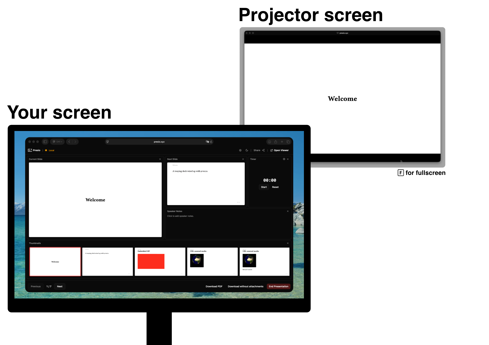

# Presio

Try it at [presio.xyz](https://presio.xyz)

Upload a PDF presentation, get a short link, and control the slideshow from one browser window while viewers watch in another.




## Features

- **Local by default** — your PDF stays in the browser and is never uploaded. Works offline; local presentations are kept for up to 7 days.
- **Controller + viewer** — drive slides from the controller window while a viewer window mirrors it, kept perfectly in sync.
- **Present across devices** — log in and sync online to get a 6-character session code. Viewers enter it on the home page and follow along live over WebSockets.
- **Shared control** — hand out a controller passphrase to let someone else drive.
- **Speaker notes** — written next to your current and next slide, rendered as markdown.
- **Embedded media** — local videos and GIFs, direct video URLs, and YouTube/Vimeo. Playback, autoplay, and seeking all stay in sync with viewers.
- **Presentation timer** — track how long you've been talking.
- **Customizable controller** — rearrange the layout and remap keyboard shortcuts.
- **Recent presentations** — pick up where you left off from the home page.
- **Download** — anyone can grab the PDF from the presentation view.

## Adding videos and speaker notes

The easiest way to attach videos and speaker notes is the [Presio Typst package](https://github.com/benedict-armstrong/presio-typst-package):

```typst
#import "@preview/presio:0.2.1": media, speaker-notes

= Introduction

Hello world.

#speaker-notes[
  Remember to mention the demo before moving on.
]

#media("https://www.youtube.com/watch?v=dQw4w9WgXcQ", width: 60%, aspect-ratio: 16/9)
```

Presio reads the attached media and notes from the PDF automatically. Notes can also be embedded by hand from plain Typst or LaTeX — see the in-app [About page](https://presio.xyz/about) for details.

## Development

```bash
npm run build    # install deps and build client + server
npm start        # start the server
npm run test:e2e # run Playwright end-to-end tests
```
